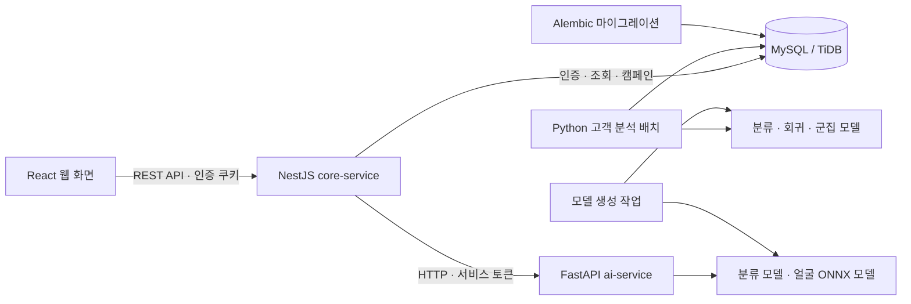

# CardOps

**신용카드 고객 분석 · 이탈 예측 · 캠페인 관리 개인 프로젝트**

CardOps는 고객 데이터 적재부터 머신러닝 분석, 고객 조회, 캠페인 대상 선정, 담당자 배정과 처리 이력까지 연결하는 웹 애플리케이션입니다. React 화면, 업무 API를 담당하는 NestJS **core-service**, 모델 추론을 담당하는 FastAPI **ai-service**로 구성하며, 모델 학습과 분석 배치는 Python으로 실행합니다.

현재 서비스는 BankChurners 기반 분류·회귀·군집 분석을 제공합니다. 날짜별 거래와 카드 해지일을 사용하는 Synchrony 데이터로 **향후 30일·60일 내 해지 예측을 검증하는 오프라인 실험**도 구현했습니다.

## 1. 현재 구현 범위

| 영역 | 구현 내용 | 현재 상태 |
| --- | --- | --- |
| 웹 서비스 | 인증·권한, 고객 분석 대시보드, 캠페인 관리, 일괄 타기팅 | NestJS API와 React 화면 연결 |
| 서비스 모델 | BankChurners 분류·회귀·군집, 고객 분석 배치, 모델·분석 이력 저장 | 기존 API와 DB에 연결 |
| 시간순 해지 예측 | Synchrony 고객별 기준일 데이터, 30일·60일 해지 분류, 특징공학, 모델 비교·검증 | 별도 오프라인 실험, 서비스 미연결 |
| 실행·배포 | Docker Compose, 모델 생성 작업, DB 마이그레이션, Render 배포 설정 | 설정과 실행 스크립트 구현 |

BankChurners는 고객별 월별 반복 기록을 제공하지 않으므로, 현재 서비스의 분류 점수를 **미래 특정 기간의 해지 확률**로 해석할 수 없습니다. 미래 해지 예측의 검증 범위는 아래 Synchrony 실험에서 별도로 설명합니다.

## 2. 데이터 전환 배경: 기존 한계와 개선 방향

BankChurners 데이터의 한계와 기존 분석 결과의 해석 범위, 새로운 데이터로 전환하는 이유는 별도 문서에 정리했습니다. 향후 시간순 예측·평가와 월별 MLOps로 확장하기 위해 거래 시점과 카드 해지일을 연결하는 Synchrony 실험을 진행하고 있습니다.

[**기존 데이터의 문제점과 전환 배경 README**](docs/data_transition/README.md)에서 기존 분석 내용, 새로운 데이터로 개선하는 방향, 현재 구현 범위와 남은 작업을 확인할 수 있습니다.

## 3. 주요 기능

### 인증과 계정 관리

- 아이디·비밀번호 회원가입과 로그인, 관리자 가입 승인 및 계정 관리
- Argon2 비밀번호 해시, HttpOnly JWT 쿠키, 세션 복원과 로그아웃
- 관리자·분석·운영·마케팅 역할에 따른 API 및 화면 접근 제어
- 얼굴 검출·임베딩을 사용하는 얼굴 회원가입·로그인
- 로그인 시도 제한과 인증 이벤트 기록

### 고객 분석

- 고객 목록·상세 조회, 고객 ID·위험도·군집 필터, 정렬과 페이지네이션
- 분류 점수, 위험 구간, 예상 거래건수, 활동성 갭, 고객 군집 표시
- 고객별 분석 이력과 최신 모델 실행·배치 상태 조회
- 고객 특성 분포, 상관관계, 군집 프로파일 등 분석 차트
- 필터 결과 CSV 내보내기와 캠페인 후보 조회

### 캠페인 업무

- 캠페인 생성·조회·수정과 생애주기 상태 관리
- 대상 등록, 담당자 배정, 접촉·완료·취소 및 처리 결과 기록
- 세그먼트별 일괄 타기팅의 미리보기·실행·취소·재실행
- 수신 거부, 최근 접촉, 활성 캠페인 중복에 따른 대상 제외
- 대상 변경 이벤트, 처리 큐와 SLA 현황 조회
- A/B 그룹 배정, 결과 입력, 전환·유지·비용 집계 화면

캠페인 성과 계산과 합성 시연 데이터는 업무 흐름을 확인하는 기능입니다. 화면의 ROI·증분효과 수치만으로 실제 이탈 방지 효과나 매출 기여가 검증되었다고 판단하지 않습니다.

### 역할별 사용 흐름

| 역할 | 주요 작업 |
| --- | --- |
| 관리자 (`admin`) | 계정 승인·관리, 고객 조회, 캠페인 관리와 대상 처리 |
| 분석 (`analyst`) | 고객 특성·분석 결과·모델 이력 및 캠페인 조회 |
| 마케팅 (`marketing`) | 캠페인 기획, 대상 등록, 일괄 타기팅 |
| 운영 (`operations`) | 배정된 대상의 접촉·처리와 결과 입력 |

```text
로그인 → 고객 특성·분석 결과 확인 → 캠페인 후보 검토
       → 캠페인 생성·담당자 배정 → 처리 결과 입력 → 이력 확인
```

## 4. 시스템 구조



- **NestJS core-service**: 기능별 `controllers → services → repositories` 레이어로 나뉩니다. 컨트롤러는 HTTP·쿠키, 서비스는 권한·업무 규칙, Repository는 SQL·DB 접근을 담당합니다. 여러 저장 작업은 UnitOfWork로 같은 트랜잭션에 묶습니다.
- **FastAPI ai-service**: 별도 Python 컨테이너에서 모델을 적재하고 예측·얼굴 검출·임베딩 API를 제공합니다. Core가 공유 토큰으로 호출하며 사용자 인증과 캠페인 처리는 Core에 있습니다.
- **Python 배치**: 고객 데이터를 적재하고 분류·회귀·군집 결과, 고객 특성 스냅샷, 모델 실행 및 스코어링 배치 이력을 저장합니다.
- **DB**: NestJS는 `mysql2`, Python은 SQLAlchemy를 사용하며, 스키마 변경은 Alembic으로 관리합니다.
- **Synchrony 실험**: `src/experiments/synchrony/`에서 독립 실행하며, 결과를 기존 서비스 DB나 API에 자동 반영하지 않습니다.

운영 진입점은 `backend/core-service/src/main.ts`와 `backend/ai-service/cardops_ai/main.py`입니다. 이전 Python 업무 API는 `cardops_ai/app/legacy_main.py`에 비교 테스트용으로 보존하며 서비스에 등록하지 않습니다. [백엔드 구조와 실행](backend/README.md)

### 기술 스택

| 영역 | 기술 |
| --- | --- |
| Frontend | React 19, TypeScript, Vite, Recharts |
| Backend | NestJS 11·Node.js 24 (Core), FastAPI·Python 3.13 (AI), mysql2 |
| Python 실행 환경 | Python 3.13, SQLAlchemy, Alembic |
| 데이터·모델 | pandas, NumPy, scikit-learn, LightGBM, XGBoost, CatBoost, joblib, ONNX |
| 데이터베이스 | MySQL 8.4, TiDB Cloud 연결 설정 |
| 테스트 | Vitest, Testing Library, Python unittest·pytest |
| 실행·배포 | Docker Compose, Render Docker Web Service·Static Site |

## 5. 데이터와 모델

### BankChurners — 현재 서비스 연결

원본은 `data/raw/BankChurners.csv`이며 10,127명의 고객 정보를 포함합니다. 정제본은 `data/processed/bankchurners_clean.csv`입니다. 정제 규칙은 [데이터 설명](data/README.md)에 정리되어 있습니다.

| 모델 | 구현 | 결과의 의미 |
| --- | --- | --- |
| 분류 | LightGBM 최종 모델과 manifest 기반 추론 | 데이터에 기록된 이탈·비이탈 상태의 분류 점수 |
| 회귀 | VotingRegressor 기반 예상 거래건수와 활동성 갭 | 같은 관측 기간의 예상 거래건수와 실제 거래건수 차이 |
| 군집 | K-means·GMM 학습, 활동성 갭 군집의 분석 배치 연결 | 입력 특성이 유사한 고객 그룹 |

학습 코드는 [`src/final/`](src/final/)에 있고, 생성 모델은 `outputs/models/`에 저장합니다. 분류 모델의 입력 스키마·파일 정보·판정 임계값은 manifest로 관리합니다.

활동성 갭은 다음 달 거래 감소를 관측한 값이 아니며, 군집 이름은 실제 고객 가치나 개입 효과를 검증한 등급이 아닙니다.

### Synchrony — 시간순 해지 예측 실험

#### 데이터셋 출처와 다운로드

GitHub 사용자 **chawanaryan19**가 공개한 프로젝트의 `Datasets.zip`을 사용합니다. 작성자는 이 프로젝트를 **Synchrony Analytics Hackathon 2026**의 제휴 신용카드 이용 비중(Share of Wallet) 감소와 고객 세분화를 분석한 작업으로 소개합니다. CardOps가 원본을 확보한 경로는 해당 참가자의 공개 저장소입니다.

- [공개 저장소와 데이터 설명](https://github.com/chawanaryan19/Customer-and-Credit-Card-Analysis---Declining-Share-of-Wallet)
- [원본 ZIP 다운로드](https://raw.githubusercontent.com/chawanaryan19/Customer-and-Credit-Card-Analysis---Declining-Share-of-Wallet/main/Datasets.zip)
- [저장소에 포함된 대회 문제 설명서](https://github.com/chawanaryan19/Customer-and-Credit-Card-Analysis---Declining-Share-of-Wallet/blob/main/Problem%20Statement.pdf)

#### 원본 구성과 규모

다음 값은 **로컬 원본 ZIP을 직접 확인한 결과**입니다. ZIP의 `Datasets/` 디렉터리에 CSV 4개가 들어 있습니다.

| 파일 | 행 수 | 주요 내용 |
| --- | ---: | --- |
| `Customer Data.csv` | 45,000 | 고객 ID, 나이·성별·멤버십, 카드 발급일·해지일, 한도·APR |
| `Transaction Data.csv` | 446,425 | 고객·거래 ID, 거래일, 금액·건수, 구매·반품, 결제수단·상품 범주 코드 |
| `Payment Code.csv` | 5 | 결제수단 코드와 이름 대응표 |
| `Category Code.csv` | 10 | 상품 범주 코드와 이름 대응표 |

- **거래 관측 기간:** 2024-08-01 ~ 2026-07-31, 총 24개월
- **대상 카드:** `Payment_Code = 3`, 결제수단 표의 `ABC Bank Credit Card`
- **거래 범위:** 공개 설명에 기재된 `XYZ Inc.` 제휴몰의 거래
- **거래건수:** 한 행이 여러 건을 포함할 수 있으므로 행 수와 `Number_of_Transactions`의 합계를 구분합니다.
- **고객·날짜 연결:** `Customer_ID`로 고객과 거래를 연결하고 `Transaction_Date`, `Credit_Card_Open_Date`, `Credit_Card_Closed_Date`로 기준일별 고객 상태와 이후 정답을 구성합니다.

#### 다운로드 후 전처리 시작

다운로드한 ZIP을 저장소 루트 기준 `data/raw/Synchrony/Datasets.zip`에 저장합니다. 압축을 미리 풀 필요 없이 [Synchrony 전처리 노트북](notebooks/Synchrony/01_data_load_clean.ipynb)에서 원본을 바로 읽습니다. 실행 방법은 [전처리 작업 안내](notebooks/Synchrony/README.md)를 참고합니다.

- 원본 ZIP 크기: **7,067,993바이트**, 약 **7.07MB**
- 원본 ZIP SHA-256: `bf66d162bbbf564e93c45623d5a3f89606acb18e6accf3bef157ef1652f4b5cf`
- 파일 확인일: **2026-09-26**. 최초 다운로드 날짜를 의미하지 않습니다.
- 향후 정제본 저장 위치: `data/processed/Synchrony/`

원본 ZIP과 Synchrony 정제본 디렉터리는 현재 `.gitignore`로 제외해 로컬에서 관리합니다. 데이터 설명은 [데이터 README](data/README.md)에서도 확인할 수 있습니다.

#### 현재 실험 구현과 평가 결과

기준일까지의 거래로 이후 30일·60일 해지를 예측하는 분류를 실험했습니다. 다음 달 거래량을 예측하는 회귀와 고객 행동 군집 분석은 새 데이터에 맞춰 학습·평가를 이어갈 범위입니다.

구현한 내용:

1. 기준일까지 발급되고 아직 해지하지 않은 고객의 월말 스냅샷 생성
2. 기준일까지의 거래만 사용한 최근성·빈도·금액·이용 변화 특징 계산
3. 이후 30일·60일 내 기록된 카드 해지를 정답으로 생성하고, 관측 기간이 부족한 정답 제외
4. 보유기간 위험, 시기별 변화, 결제수단 이동 특징과 로지스틱 회귀·CatBoost·순위 결합 비교
5. 과거 개발 기간에서 후보 선택 후 모델을 저장·동결하여 이후 기간 평가
6. 고객 단위 bootstrap, 중복을 제외한 해지 고객 수, 최소 14일 전 포착 여부 계산
7. 실험 규칙·입력과 코드 해시·선택 결과·모델·고객별 예측 저장

최신 비교는 기존 모델 2개와 신규 후보 6개를 대상으로 했습니다. 아래 값은 **매달 위험 점수 상위 10%를 확인할 때 실제 해지 고객을 찾은 비율의 월평균**입니다.

| 예측 대상 | 기존 실험 모델 | 신규 결합 후보 | 보유기간 중심 비교 모델 |
| --- | ---: | ---: | ---: |
| 30일 내 해지 | 34.76% | 35.27% | 35.50% |
| 60일 내 해지 | 31.55% | 32.74% | 32.92% |

- 개발 기준일: 2025년 7~12월 말. 각 학습 시점에 정답 관측이 끝난 과거 표본만 사용합니다.
- 모델 동결일: **2026-03-30**. 이후 평가 중에는 재학습하지 않습니다.
- 평가 기준일: 30일 모델은 2026년 3~6월 말, 60일 모델은 3~5월 말입니다.
- 같은 고객의 과거·미래 등장은 허용하며, 동일 고객·동일 기준일의 학습·평가 중복은 금지합니다.
- 해당 평가 기간은 이전 실험에도 사용했습니다. **처음 보는 독립 테스트 성능이 아닌, 재사용한 기간의 시간순 재검증 결과**입니다.
- 신규 후보는 사전에 정한 개발 개선 기준을 통과하지 못했습니다. 실험 결과는 기존 서비스 모델에 배포하지 않았습니다.

이 실험에서 회귀·군집의 서비스 전환, 자동 재학습·모델 승격·롤백까지 구현한 것은 아닙니다. 현재 확보한 구현 범위는 날짜별 입력 구성, 시간순 모델 비교와 재현 가능한 검증입니다. 원본 데이터의 실제·합성 여부와 재사용 라이선스는 별도 확인이 필요하며 원본 ZIP은 저장소에 포함하지 않습니다.

[실험 실행 방법](src/experiments/synchrony/README.md) · [개선 계획](docs/synchrony_improvement_plan.md) · [상세 결과와 신뢰구간](docs/synchrony_advanced_evaluation.md) · [학습·평가 분리 점검](docs/synchrony_split_audit.md)

## 6. 로컬 실행

Docker Desktop 또는 Docker Engine과 Compose를 준비하고, 저장소 루트에서 실행합니다.

### 환경 설정

```bash
cp .env.example .env
```

`.env`에서 다음 값을 설정합니다.

| 변수 | 용도 |
| --- | --- |
| `MYSQL_ROOT_PASSWORD` | 로컬 MySQL 관리자 비밀번호 |
| `MYSQL_PASSWORD` | 애플리케이션 DB 계정 비밀번호 |
| `JWT_SECRET` | 인증 쿠키 서명용 32자 이상의 임의 문자열 |
| `AI_SERVICE_TOKEN` | Core·AI 공유 토큰, JWT와 별도로 만든 32자 이상의 문자열 |
| `MYSQL_PORT` | 호스트 MySQL 포트, 예제 파일은 `3307` |

로컬 시연 계정이 필요하면 `ALLOW_TEST_USER_SEEDING=true`로 설정하고 `TEST_ADMIN_PASSWORD`, `TEST_ANALYST_PASSWORD`, `TEST_OPERATIONS_PASSWORD`, `TEST_MARKETING_PASSWORD`에 각각 12자 이상의 로컬 비밀번호를 지정합니다. 예제 환경 파일에서는 시드가 비활성화되어 있습니다. `.env`는 Git에 포함하지 않습니다.

### 서비스 시작과 고객 분석

```bash
docker compose up -d --build
docker compose ps -a
```

처음 실행하면 `model-builder`가 모델을 준비한 뒤 AI 서비스가 시작됩니다. 별도로 `db-init`이 Alembic 마이그레이션과 선택한 계정 시드를 완료하면 Core 서비스가 시작됩니다. Node 이미지에는 Python을 포함하지 않습니다.

백엔드 시작 후 고객 데이터와 분석 결과를 적재합니다.

```bash
docker compose run --rm jobs python -m cardops_ai.scripts.import_customers
docker compose run --rm jobs python -m cardops_ai.scripts.run_analysis_batch
```

| 접속 대상 | 주소 |
| --- | --- |
| 웹 화면 | <http://localhost:5173> |
| API 문서 | <http://localhost:8000/docs> |
| OpenAPI | <http://localhost:8000/openapi.json> |
| 생존·준비 상태 | <http://localhost:8000/live> · <http://localhost:8000/ready> |

시드를 활성화한 경우 `test_admin`, `test_analyst`, `test_operations`, `test_marketing`으로 역할별 화면을 확인할 수 있습니다. 비밀번호는 각 환경변수에 지정한 값입니다.

실행 순서·로그·모델 재생성은 [Docker Compose 실행 가이드](docs/docker_compose_runbook.md)를 참고합니다. 호스트에서 NestJS를 직접 실행하는 방법은 [백엔드 문서](backend/README.md)에 있습니다.

## 7. 검증 명령

호스트에서 개발·검증할 때는 Node.js 24, pnpm 11, Python 환경을 준비합니다. 아래는 저장소 루트에서 실행하는 명령입니다.

```bash
# NestJS
npm --prefix backend/core-service ci
npm --prefix backend/core-service run typecheck
npm --prefix backend/core-service test
npm --prefix backend/core-service run build

# FastAPI 및 기존 Python 배치·마이그레이션
python -m pip install -r backend/ai-service/requirements-dev.txt
python -m pytest backend/ai-service/tests -q

# React
pnpm --dir frontend install --frozen-lockfile
pnpm --dir frontend typecheck
pnpm --dir frontend test
pnpm --dir frontend build

# Synchrony 오프라인 실험 전용 Python 환경에서 실행
python -m pip install -r src/experiments/synchrony/requirements.txt
python -m unittest discover -s src/experiments/synchrony -t . -p 'test_*.py'
```

Synchrony 추가 개선 작업에서는 미래 정보 변경 불변성, 학습·평가 분리, 위험 일수 계산, 순위·bootstrap, 후보 선택 규칙에 관한 **테스트 34개**가 통과했습니다. 원본·입력·코드·저장 모델의 일관성은 별도 **68개 검사**로 확인했으며, 기록은 [실험 보고서](docs/synchrony_advanced_evaluation.md)에 있습니다. 이 수치는 전체 서비스의 통합 테스트 결과를 뜻하지 않습니다.

NestJS 테스트는 API 경로 호환성, 레이어 의존성, 업무 규칙, 트랜잭션과 AI 호출 실패 처리를 검증합니다. AI 테스트는 내부 토큰 인증·입력 검증·모델 오류를 확인합니다. `backend/ai-service/tests/`의 기존 Python 업무 API 테스트는 비교용이며 NestJS의 전체 DB 응답 동등성을 보장하지 않습니다.

서비스 분리 작업에서는 **Core 테스트 23개·신규 AI 테스트 15개**, **HTTP 검사 58개**(정상 서비스 54개·AI 중단 상태 4개), 두 Docker 이미지 빌드를 확인했습니다. 기존 Python 비교 테스트의 실패 2개와 건너뛴 검사 4개를 포함한 검증 범위는 [구조 변경 검증 기록](docs/backend_service_refactor.md)에 정리했습니다.

## 8. 배포 구성

[`render.yaml`](render.yaml)에 세 서비스를 정의합니다.

- **Frontend**: React 빌드 결과를 Render Static Site로 제공
- **Core**: NestJS Docker Web Service (`cardops-backend`), `/live` 생존 확인
- **AI**: FastAPI Docker Web Service (`cardops-ai`), `/ready` 모델 준비 확인. 무료 서비스 간 호출은 HTTPS와 공유 토큰을 사용
- **DB**: `DATABASE_URL`로 MySQL 호환 DB 연결, TiDB Cloud 환경 설정 지원
- **환경 설정**: `JWT_SECRET`, `CORS_ORIGINS`, `AUTH_COOKIE_SECURE`, `VITE_API_BASE_URL`, Core의 `AI_SERVICE_URL`, 두 서비스가 공유하는 `AI_SERVICE_TOKEN` 등

현재 저장소에는 GitHub Actions workflow가 없습니다. Render의 Git 저장소 연동으로 배포하는 구성이며, 자동 배포 활성화와 대상 브랜치는 Render 서비스 설정에서 관리합니다. 모델을 이미지 빌드 과정에서 생성하는 작업과 데이터 유입에 따른 자동 재학습·승격은 구분합니다.

배포 설정은 [Render 배포 가이드](docs/free_render_deploy.md), 컨테이너 실행 정의는 [`compose.yaml`](compose.yaml)을 참고합니다.

## 9. 디렉터리 구조

```text
CardOps/
├── backend/
│   ├── core-service/         # NestJS: Controller → Service → Repository
│   ├── ai-service/           # FastAPI 추론 + Python 배치·마이그레이션
│   └── README.md             # 서비스 경계·실행·호환성
├── frontend/                 # React 화면·API 클라이언트·테스트
├── src/
│   ├── final/                # BankChurners 최종 모델 학습
│   └── experiments/synchrony/ # 시간순 해지 예측 실험
├── data/                     # 원본·정제·합성 데이터
├── notebooks/                # 데이터셋별 전처리·EDA·모델 실험
│   ├── BankChurners/          # 기존 BankChurners 노트북
│   └── Synchrony/             # Synchrony 전처리 시작 노트북
├── dashboard/                # 별도 Streamlit 모델 분석 화면
├── docs/                     # 설계·실행·검증 문서
├── outputs/                  # 모델·예측·평가 산출물
├── compose.yaml              # 로컬 컨테이너 구성
└── render.yaml               # 배포 서비스 정의
```

생성 모델과 대용량 실험 산출물은 기본적으로 Git에서 제외합니다. 실행에 필요한 설정과 재현 코드는 저장소에서 관리합니다.

## 10. 상세 문서

| 문서 | 내용 |
| --- | --- |
| [백엔드](backend/README.md) | Core·AI 서비스 경계, 레이어별 책임과 HTTP 통신 |
| [Core 서비스](backend/core-service/README.md) | NestJS 레이어드 아키텍처와 개발·실행·검증 |
| [AI 서비스](backend/ai-service/README.md) | FastAPI 추론 API, 서비스 토큰과 Python 실행 |
| [구조 변경 검증](docs/backend_service_refactor.md) | 서비스 분리 검증 결과와 기존 테스트의 제한 |
| [프론트엔드](frontend/README.md) | 화면 구성과 프론트엔드 개발 |
| [데이터 전환 배경](docs/data_transition/README.md) | BankChurners의 한계와 새로운 데이터로 개선하는 이유 |
| [분석 노트북](notebooks/README.md) | BankChurners·Synchrony 작업 공간과 실행 방법 |
| [데이터 출처와 구성](data/README.md) | 원본 다운로드, CSV 구성·규모, 파일 해시와 저장 경로 |
| [DB 스키마](docs/database_schema.md) | 고객·분석·캠페인·인증 데이터 구조 |
| [고객 분석 배치](docs/phase2_analysis_batch.md) | 모델 실행과 분석 결과 저장 |
| [고객 분석 조회 API](docs/customer_insights_api.md) | 목록·상세·이력 조회 |
| [캠페인 업무 흐름](docs/campaign_workflow.md) | 상태 전이와 역할별 권한 |
| [일괄 타기팅](docs/bulk_targeting.md) | 후보 고정·제외 규칙·실행 이력 |
| [캠페인 성과 집계](docs/campaign_performance.md) | 그룹 배정·결과 입력·집계 명세 |
| [시연 데이터](docs/demo_data.md) | 합성 고객과 캠페인 데이터 생성 |
| [Synchrony 실험](src/experiments/synchrony/README.md) | 실험 코드와 재실행 방법 |
| [Synchrony 개선 결과](docs/synchrony_advanced_evaluation.md) | 후보 비교·신뢰구간·검증 한계 |
