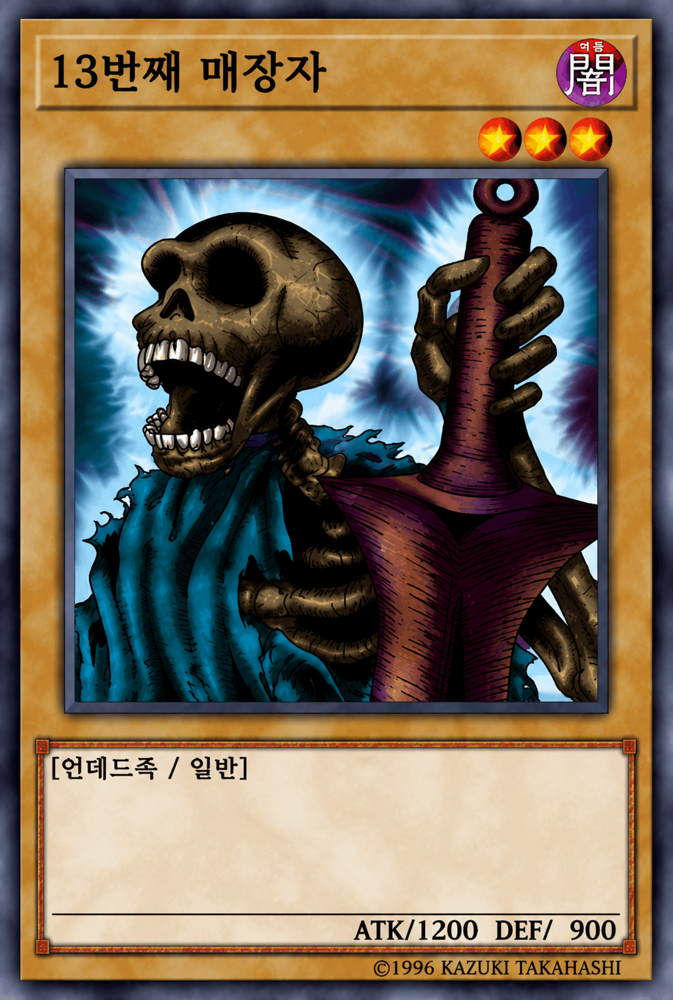
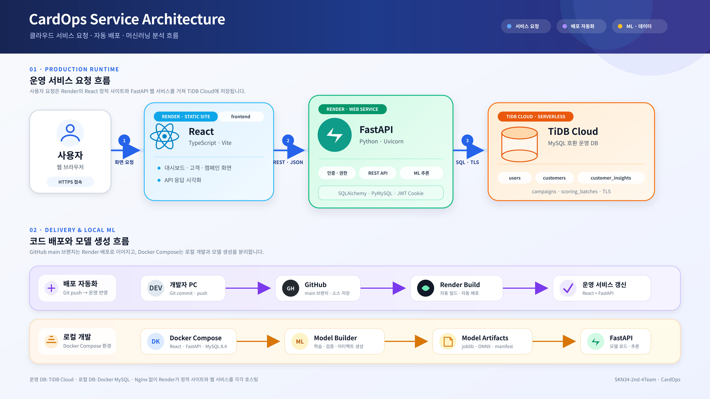
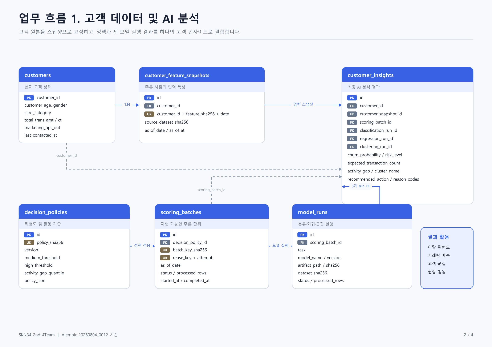
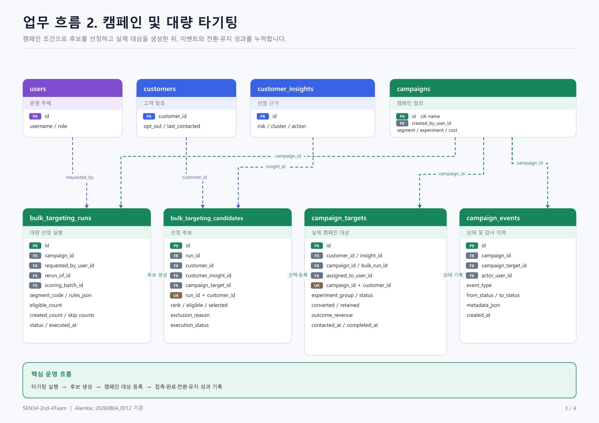
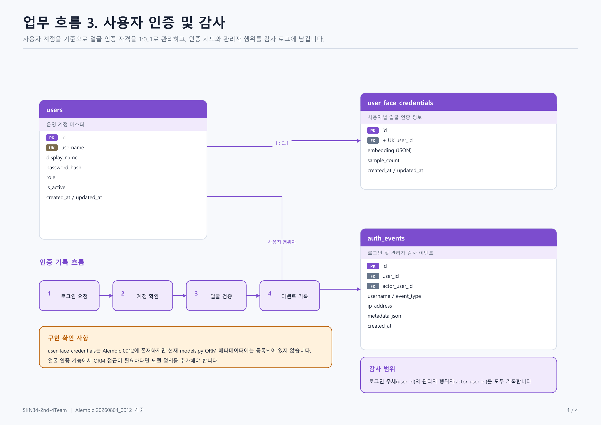

<div align="center">
  
</div>

<br />

# 1. 팀 소개

## 📌 팀명

<h1 align="center">🔥 SKN34-2nd-4Team : 불사조 🔥</h1>

<br />

## 📌 팀 멤버

<table>
  <thead>
    <tr>
      <th align="center">김건우</th>
      <th align="center">이성민</th>
      <th align="center">전진영</th>
      <th align="center">최성욱</th>
      <th align="center">황수빈</th>
    </tr>
  </thead>
  <tbody>
    <tr>
      <td align="center"></td>
      <td align="center"></td>
      <td align="center"></td>
      <td align="center"></td>
      <td align="center"></td>
    </tr>
    <tr>
      <td align="center"><a href="https://github.com/ilil1">@ilil1</a></td>
      <td align="center"><a href="https://github.com/lsm15111">@lsm15111</a></td>
      <td align="center"><a href="https://github.com/msi67811-jpg">@msi67811-jpg</a></td>
      <td align="center"><a href="https://github.com/Overlay1010">@Overlay1010</a></td>
      <td align="center"><a href="https://github.com/subinss838">@subinss838</a></td>
    </tr>
    <tr>
      <td align="center">팀원1</td>
      <td align="center"><strong>팀장</strong></td>
      <td align="center">팀원2</td>
      <td align="center"><strong>팀장</strong></td>
      <td align="center">팀원3</td>
    </tr>
  </tbody>
</table>

<br />

# 2. 프로젝트 개요

## 📌 프로젝트 명

### CardOps - 신용카드 고객 이탈 조기경보 및 고객 관리 서비스

## 📌 프로젝트 소개

CardOps는 신용카드 고객 데이터를 바탕으로 고객의 이탈 가능성을 예측하고, 예상 거래활동과 실제 거래활동의 차이를 분석해 위험 고객을 조기에 발견하는 머신러닝 기반 고객 관리 서비스입니다.

분류·회귀·군집 모델의 결과를 결합하여 고객별 이탈 위험도와 활동성 상태, 고객 유형을 제공하며, 분석 결과를 대시보드와 캠페인 업무에 연결해 부서별 의사결정을 지원합니다.

## 📌 프로젝트 필요성(배경)

- 신규 고객을 확보하는 것만큼 기존 고객의 이탈을 예방하고 관계를 유지하는 것이 중요합니다.
- 단순 이탈 여부만 예측하면 고객의 활동이 언제부터 감소했는지 파악하기 어렵습니다.
- 고객마다 연령, 신용한도, 거래 규모와 이용 패턴이 다르므로 동일한 기준으로 관리하기 어렵습니다.
- 이탈 확률, 예상 대비 거래활동, 고객군 특성을 함께 분석하면 위험 고객을 더 구체적으로 구분하고 적절한 대응 전략을 수립할 수 있습니다.

## 📌 프로젝트 목표

1. 비즈니스 문제를 이해하고 고객 이탈 방지를 위한 머신러닝 모델 활용 계획을 수립합니다.
2. 모델 학습에 필요한 데이터 정제, 탐색적 데이터 분석(EDA), 전처리 및 특징공학을 수행합니다.
3. 분류 모델로 고객별 이탈 여부와 이탈 확률을 예측합니다.
4. 회귀 모델로 고객별 예상 거래건수를 계산하고 실제 거래건수와의 차이인 활동성 갭을 산출합니다.
5. 군집 모델로 행동과 신용여력, 활동성 갭이 유사한 고객을 세분화합니다.
6. 기본 모델, 특징공학 모델, 하이퍼파라미터 탐색 결과를 비교해 과제별 최종 모델을 선정합니다.
7. React, FastAPI, TiDB Cloud를 연동해 고객 분석 결과를 조회하고 활용할 수 있는 서비스를 구현합니다.
8. GitHub와 Render를 이용해 프론트엔드와 백엔드를 배포하고, Docker Compose로 재현 가능한 로컬 개발 환경을 구성합니다.

## 📌 데이터 소개

### 1) 데이터 출처

- 파일: `data/raw/BankChurners.csv`
- 출처: [Kaggle Credit Card Customers Dataset](https://www.kaggle.com/datasets/sakshigoyal7/credit-card-customers)
- 크기: 10,127명 × 23개 컬럼
- 중복 행: 0개
- 결측값: 0개

### 2) 전처리 데이터

전처리 결과는 `data/processed/bankchurners_clean.csv`로 저장합니다.

- `CLIENTNUM`: 단순 고객 식별자이므로 제거
- Naive Bayes 결과 컬럼 2개: 기존 모델의 결과값이므로 제거
- `Attrition_Flag`: 고객 이탈 여부를 숫자형 `Target`으로 변환
  - `Existing Customer` → `0`
  - `Attrited Customer` → `1`
- `Unknown` 범주: 별도 결측값으로 처리하지 않고 하나의 범주로 유지

전처리 데이터는 10,127행 × 20개 컬럼이며, `Target`을 제외한 19개 고객 특성을 모델 입력값으로 사용합니다.

<br />

# 3. 기술 스택

<table>
  <tr>
    <th>Frontend</th>
    <td>   </td>
  </tr>
  <tr>
    <th>Backend &amp; DB</th>
    <td>    </td>
  </tr>
  <tr>
    <th>Data &amp; ML</th>
    <td>  </td>
  </tr>
  <tr>
    <th>Infra &amp; 협업</th>
    <td>   </td>
  </tr>
</table>

<br />

# 4. 시스템 아키텍처

<div align="center">
  
</div>

## 📌 운영 서비스 흐름

1. 사용자는 웹 브라우저를 통해 Render의 **Static Site**로 배포된 React 프론트엔드에 접속합니다.
2. React 프론트엔드는 Render의 **Web Service**로 실행되는 FastAPI 백엔드에 REST API 요청을 보내고 JSON 형식의 응답을 받습니다.
3. FastAPI는 사용자 인증과 권한 관리, 고객 및 캠페인 API, 머신러닝 모델 추론을 담당합니다.
4. FastAPI는 SQLAlchemy와 PyMySQL을 이용해 TiDB Cloud에 연결하며, 사용자·고객·분석 결과·캠페인 데이터를 조회하거나 저장합니다.

## 📌 배포 흐름

- 개발자가 코드를 GitHub `main` 브랜치에 반영하면 Render가 변경된 코드를 가져와 자동으로 빌드하고 배포합니다.
- 프론트엔드는 React 정적 사이트, 백엔드는 FastAPI 웹 서비스로 각각 분리해 배포합니다.
- 애플리케이션은 Render에서 실행하고 운영 데이터베이스는 MySQL 호환 클라우드 데이터베이스인 TiDB Cloud에서 관리합니다.
- 현재 프로젝트는 Nginx를 별도로 구성하지 않으며, 정적 사이트 제공과 외부 HTTPS 연결은 Render가 담당합니다.

## 📌 로컬 개발 및 머신러닝 흐름

- Docker Compose로 React, FastAPI, MySQL 8.4, Model Builder를 함께 실행해 팀원이 동일한 로컬 개발 환경을 재현할 수 있습니다.
- Model Builder는 분류·회귀·군집 모델을 학습하고 검증한 뒤 FastAPI가 사용할 `joblib`, `ONNX`, manifest 형식의 모델 아티팩트를 생성합니다.
- FastAPI는 생성된 모델 아티팩트를 불러와 고객 이탈 확률, 예상 거래건수, 활동성 갭, 고객 군집 등의 분석 결과를 제공합니다.
- 로컬 MySQL과 운영 TiDB Cloud는 서로 분리되어 있으며, `DATABASE_URL` 설정에 따라 백엔드가 사용할 데이터베이스가 결정됩니다.

<br />

# 5. ERD

## 📌 고객 데이터 및 AI 분석

<div align="center">
  
</div>

고객 원본 데이터를 분석 시점별 특성 스냅샷으로 보존하고, 판정 정책과 분류·회귀·군집 모델의 실행 이력을 하나의 스코어링 배치로 관리합니다. 최종 분석 결과는 `customer_insights`에 저장하여 고객별 이탈 위험도, 예상 거래건수, 활동성 갭, 고객 군집과 권장 행동을 조회할 수 있습니다.

<br />

## 📌 캠페인 및 대량 타기팅

<div align="center">
  
</div>

고객 인사이트를 기반으로 타기팅 후보를 생성하고, 실행 결과를 실제 캠페인 대상과 연결합니다. 캠페인의 생성, 담당자 배정, 접촉, 완료, 전환과 유지 성과는 대상 및 이벤트 테이블에 누적하여 전체 캠페인 처리 이력을 추적할 수 있습니다.

<br />

## 📌 사용자 인증 및 감사

<div align="center">
  
</div>

`users`는 운영 계정과 역할을 관리하고, `user_face_credentials`는 사용자별 얼굴 임베딩을 1:0..1 관계로 저장합니다. `auth_events`에는 로그인 결과와 관리자 행위자를 함께 기록하여 인증 및 계정 관리 이력을 감사할 수 있습니다. 얼굴 인증 ORM은 `backend/app/face/models.py`에 별도로 정의되어 있으며 공통 SQLAlchemy `Base`에 정상 등록됩니다.

<br />

# 6. 폴더구조

```text
CardOps/
├── backend/       # FastAPI 백엔드, DB 마이그레이션, 시드·배치
├── frontend/      # React·TypeScript 프론트엔드
├── src/           # 머신러닝 학습, 모델 코드
├── data/          # 원천·정제·합성 데이터
├── notebooks/     # EDA 및 모델 실험 노트북
├── dashboard/     # 데이터 분석 및 시각화 대시보드
├── docs/          # 아키텍처, ERD, 발표 자료 및 프로젝트 문서
├── outputs/       # 학습된 모델 아티팩트 및 분석 결과
├── compose.yaml   # 로컬 Docker Compose 실행 설정
├── render.yaml    # Render 배포 설정
└── README.md      # 프로젝트 안내 문서
```

각 폴더는 서비스 운영에 필요한 핵심 영역을 기준으로 구성되어 있습니다. 로컬 캐시, 가상환경, 임시 파일과 같은 개발 환경 전용 항목은 구조에서 제외했습니다.

<br />

# 7. 수행결과

- [분류 수행결과 PPT 자료](./docs/ppt/분류.pptx)
- [회귀·군집 수행결과 PPT 자료](<./docs/ppt/회귀, 군집.pptx>)
- [비즈니스 로직 발표 PPT 자료](<./docs/ppt/비즈니스 로직.pptx>)
- [시스템 아키텍처 발표 PPT 자료](<./docs/ppt/시스템 아키텍처.pptx>)

- [분류 수행결과 PDF 자료](./docs/pdf/분류.pdf)
- [회귀·군집 수행결과 PDF 자료](<./docs/pdf/회귀, 군집 발표.pdf>)
- [비즈니스 로직 발표 PDF 자료](<./docs/pdf/비즈니스 로직.pdf>)
- [시스템 아키텍처 발표 PDF 자료](<./docs/pdf/시스템 아키텍처.pdf>)

<br />

# 8. 한줄 회고

## 김건우

> 다들 프로젝트에 적극적으로 참여해서 즐기면서 잘 진행할 수 있었습니다. 2차 프로젝트 수고 많으셨습니다.

## 이성민

> 머신러닝 모델을 비즈니스에 적용하는 과정과 서비스 운영 흐름을 개발 관점에서 이해하며 많은 것을 배울 수 있었습니다. 무엇보다 팀원 모두가 적극적으로 협업하고 함께 성장하려는 분위기가 형성되어, 프로젝트를 더욱 의미 있게 진행할 수 있어서 좋았습니다.

## 전진영

### 팀원들과 함께하며 배운 점과 성장

프로젝트 초반의 막막함 속에서도 귀찮은 내색 없이 질문을 받아주고 팁을 건네준 팀원들 덕분에 큰 성장을 이룰 수 있었습니다.

- 최성욱님: 작성물에 대한 피드백을 통해 문제를 깊이 있게 파고드는 집요함과 검토 습관을 배웠습니다.
- 황수빈님: 밝은 에너지로 분위기를 이끌며, 주제 선정 시 새로운 시각을 제시하고 작업 흐름과 요약을 정리하는 높은 참여도를 배웠습니다.
- 김건우님: 팀 전체의 흐름이 흔들릴 때 정확한 방향을 제시하여 나아갈 수 있도록 이끌어 주셨습니다.
- 이성민님: 전담 케어를 통해 개인 성장을 돕는 동시에 팀 전체의 코드 오류와 작업 밸런스를 바로잡아주며 가장 고생하셨습니다.

이번 프로젝트를 통해 개발자로서 팀 프로젝트에 임하는 태도를 배웠으며, “못하겠어요”가 아닌 “한번 해보겠습니다”라고 말할 수 있는 도전 의식과 자신감을 얻었습니다.

## 최성욱

> 각자 다른 시선으로 분류, 군집, 회귀, 세그먼트 설계, 시각화를 들고 모여 하나의 캠페인 전략으로 완성해가는 과정이 정말 흥미로웠습니다. 혼자였다면 놓쳤을 관점들이 서로 부딪히고 채워지면서 결과물이 훨씬 탄탄해지는 것을 느꼈고, 협업의 힘을 다시 한번 실감한 프로젝트였습니다. 다들 너무 성실하고 열심히 잘해주셔서 정말 감사합니다! 👍

## 황수빈

> 대시보드 삽질은 내가, 부활은 팀원들이. 샤라웃 투 불사조 팀원들…… 감사했습니다.
