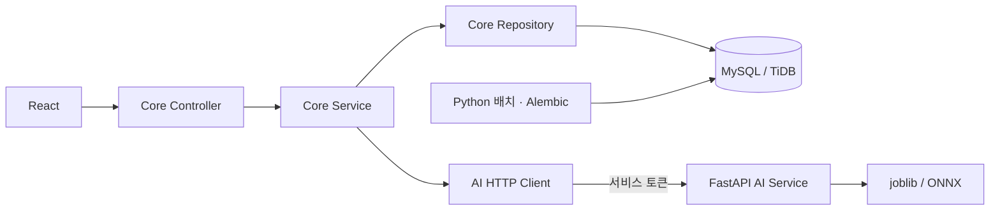

# CardOps 백엔드

백엔드는 NestJS **core-service**와 FastAPI **ai-service**로 나눕니다. 프런트엔드는 Core만 호출합니다.



## 디렉터리

```text
backend/
├── core-service/
│   ├── src/
│   │   ├── modules/
│   │   │   ├── auth/          # 회원·권한·얼굴 인증
│   │   │   ├── campaigns/     # 캠페인·일괄 타기팅·성과 집계
│   │   │   ├── read-apis/     # 고객·분석·모델 실행 이력 조회
│   │   │   └── predictions/   # 온라인 분류 예측
│   │   ├── infrastructure/   # MySQL, UnitOfWork, AI HTTP Client
│   │   └── common/           # 오류 응답, API·레이어 경계 테스트
│   └── Dockerfile            # Node.js 전용 이미지
└── ai-service/
    ├── cardops_ai/
    │   ├── main.py           # 추론 전용 FastAPI 진입점
    │   ├── app/              # 모델·특성·DB·배치 및 Python 호환 코드
    │   └── scripts/          # 데이터 적재·학습 보조·배치·시드 CLI
    ├── migrations/           # 기존 Alembic revision 유지
    ├── tests/                # AI API, 배치·마이그레이션, 이전 API 비교 테스트
    └── Dockerfile            # Python 전용 이미지
```

Core는 기능별로 `controllers/`, `services/`, `repositories/`, 필요한 `dto/`를 둡니다. 단순 추론 전달처럼 저장소가 필요 없는 기능에는 Repository를 만들지 않습니다.

## 레이어별 책임

| 레이어 | 책임 | 예 |
| --- | --- | --- |
| Controller·DTO | 경로, 요청 파싱, 쿠키, 응답 | 로그인 결과의 JWT를 HttpOnly 쿠키로 전달 |
| Service | 권한·업무 규칙, 계산, 처리 순서, 트랜잭션 범위 | 대상 중복·수신 거부·상태 전이 확인 |
| Repository | SQL, 조회 조건·정렬, 저장 | 대상 저장, 캠페인 처리 이력 저장 |
| Infrastructure | DB 연결·트랜잭션 실행, AI HTTP 통신 | mysql2 풀, timeout, 서비스 토큰 |

서비스는 DB 드라이버를 직접 호출하지 않습니다. 여러 Repository를 사용하는 변경 작업은 `UnitOfWork.transaction()`의 같은 세션을 전달하여 함께 커밋하거나 롤백합니다. 얼굴 중복·일치 판정과 사용자 계정 처리는 Core 서비스에 있고, 얼굴 검출·임베딩 연산은 AI 서비스에 있습니다.

## 서비스 간 계약

- 공개 API의 기존 `/api/v1/*`, `/docs`, `/redoc`, `/openapi.json` 경로를 유지합니다.
- Core `/live`는 프로세스 생존, `/ready`는 AI 모델까지 포함한 준비 상태를 확인합니다.
- AI `/live`, `/ready`는 최소 상태만 공개합니다. 모델 정보·추론·얼굴 처리 경로 `/internal/v1/*`는 모두 `X-Service-Token` 인증을 요구합니다.
- `AI_SERVICE_TOKEN`은 두 서비스에서 동일한 32자 이상 값으로 설정하고, JWT 서명 키와 구분합니다.
- AI 통신 실패·시간 초과·내부 인증 실패는 Core에서 **503**, 잘못된 추론 입력은 **422**로 반환합니다. 오류는 기존 `{ "detail": ... }` 형식입니다.
- AI 장애가 Core 프로세스를 종료시키지 않습니다. DB 기반 로그인·고객 조회·캠페인은 계속 요청할 수 있습니다.
- 자동 재시도는 하지 않습니다. 얼굴 이미지의 불필요한 반복 전송을 피하고 각 요청에 제한 시간을 적용합니다.

## DB·배치의 소유권

업무 HTTP API와 업무 규칙은 Core가 담당합니다. Python 배치는 분석 결과와 모델 실행 이력을 DB에 기록합니다. 스키마 변경은 기존 **Alembic 한 곳**에서 관리하며 TypeORM 등의 별도 마이그레이션을 추가하지 않습니다.

Compose의 `db-init`이 마이그레이션과 선택적 테스트 계정 시드를 실행합니다. `jobs`는 고객 적재·분석·시드 같은 명시적 작업을 위한 서비스입니다. AI 웹 프로세스 자체는 DB 연결·마이그레이션·시드를 실행하지 않습니다.

`cardops_ai/app/legacy_main.py`와 `app/api/`, `app/services/`의 이전 Python 업무 구현은 기존 배치·시드 호환성과 비교 테스트용입니다. `cardops_ai.main:app`에는 이 라우터들을 등록하지 않습니다. 새 업무 기능은 Core에 구현합니다.

## 실행·검증

```bash
# 저장소 루트에서 실행 (.env 설정은 .env.example 참고)
docker compose up -d --build
docker compose run --rm jobs python -m cardops_ai.scripts.import_customers
docker compose run --rm jobs python -m cardops_ai.scripts.run_analysis_batch

npm --prefix backend/core-service ci
npm --prefix backend/core-service run typecheck
npm --prefix backend/core-service test
npm --prefix backend/core-service run build

python -m pip install -r backend/ai-service/requirements-dev.txt
python -m pytest backend/ai-service/tests -q
```

호스트 실행과 상세 구성은 [Core 문서](core-service/README.md), [AI 문서](ai-service/README.md), [Compose 가이드](../docs/docker_compose_runbook.md), [Render 가이드](../docs/free_render_deploy.md)를 참고합니다.

이번 구조 변경은 데이터셋이나 모델을 교체하지 않습니다. BankChurners 모델은 현재 서비스에, Synchrony 모델은 기존 오프라인 실험에 각각 유지됩니다.

[구조 변경 검증 결과·기존 테스트 제한](../docs/backend_service_refactor.md)
