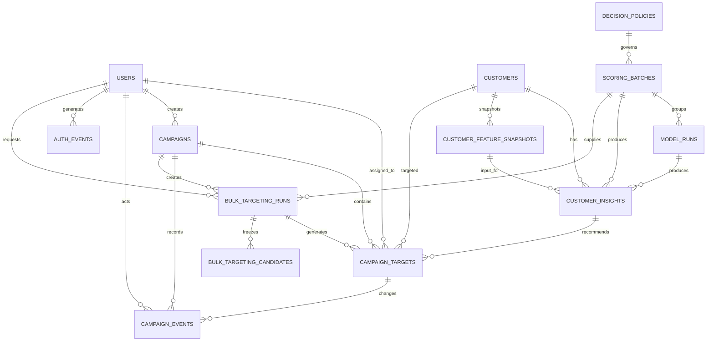

# CardOps 데이터베이스와 Alembic 가이드

구현 배경, 파일별 책임, migration 동작, 고객 CSV 적재와 테스트 결과를 포함한
전체 구현 문서는 [`phase1_database_implementation.md`](phase1_database_implementation.md)입니다.

## 구성 목적

MySQL에는 로그인 계정뿐 아니라 고객 원본 특성, 모델 실행 이력, 고객별 통합 분석
결과와 캠페인 처리 이력을 저장합니다. 테이블 변경은 SQLAlchemy `create_all()`이
아니라 Alembic migration 파일로 관리합니다.



## 테이블

| 테이블 | 저장 내용 |
|---|---|
| `users` | 팀 계정, Argon2 비밀번호 해시, 활성 여부, 업무 역할 |
| `customers` | `CLIENTNUM`을 보존한 고객 ID와 모델 입력 특성 19개, 수신 거부·최근 접촉 정책 |
| `customer_feature_snapshots` | 분석 당시 고객 19개 입력 특성과 특성 해시 |
| `decision_policies` | 위험도·추천 규칙 전체 JSON, 정책 버전과 정책 SHA-256 |
| `scoring_batches` | 분석 기준일, 데이터·정책·artifact, 논리 재사용 키와 재시도 번호 |
| `model_runs` | 모델 종류·버전, artifact·데이터·정책 SHA-256, 배치·실행 시각·상태 |
| `customer_insights` | 이탈 확률·위험 등급, 예상 거래건수·활동성 갭, 군집·추천 액션, 배치·입력 스냅샷 |
| `campaigns` | 캠페인 기본 정보·실행 기간·생명주기, A/B 정책과 비용·매출 기준 |
| `campaign_targets` | 대상 고객, 대상군·대조군, 담당자, 처리 시각·구조화 결과·유지·매출 |
| `campaign_events` | 캠페인·대상 생성, 담당자 배정, 상태 전이와 결과 변경 이력 |
| `bulk_targeting_runs` | 세그먼트 일괄 타기팅 정책, 미리보기·실행·취소·재실행과 제외 집계 |
| `bulk_targeting_candidates` | 일괄 미리보기 후보·순위·제외·선택·실행 결과 스냅샷 |
| `auth_events` | 가입·로그인·로그아웃·계정 권한 변경 보안 감사 이벤트 |

`CLIENTNUM`은 고객 조회와 테이블 연결에만 사용하며 모델 입력에는 포함하지
않습니다. `customer_insights`는 고객별 최신 값만 덮어쓰지 않고 분석 시점별로
누적합니다. 각 행은 `scoring_batches`와 세 개의 `model_runs`, 고객 입력
스냅샷을 참조합니다. `scoring_batches`는 하나의 분석 기준일과
`decision_policies`를 연결하므로 모델 실행·정책·입력·결과를 하나의 계보로
재현할 수 있습니다.

## 사용자 역할

역할은 다음 네 가지입니다.

- `admin`: 모든 사용자·캠페인·타기팅 권한
- `analyst`: 모델·분석 결과와 캠페인 조회
- `operations`: 캠페인 대상 배정·접촉·처리 결과 관리
- `marketing`: 캠페인 생성·수정과 세그먼트 타기팅 실행

회원가입 API에서 역할을 입력받지 않으며 모든 신규 계정은 `analyst` 역할과
비활성(`is_active=false`) 상태로 생성됩니다. 관리자가 승인해 활성화한 뒤에만
로그인할 수 있습니다. 캠페인 생성·수정·대상 등록·세그먼트 일괄 타기팅은
`admin`, `marketing`만 사용할 수 있습니다. 캠페인 대상 상태·담당자·처리 결과
변경은 `admin`, `operations`가 담당하며 `analyst`는 분석·캠페인 조회만
가능합니다. 대상 담당자는 별도로 활성 상태의 `operations` 역할만 지정할 수
있습니다. 수신 거부 상태 변경은 동의 데이터 보호를 위해
관리자 전용입니다.

신규 스키마에서는 `customer_insights.scoring_batch_id`가 분석 배치를,
`customer_insights.customer_snapshot_id`가 분석 당시 입력을
`customer_feature_snapshots`에 연결합니다. 고객 특성이 이후 upsert로 변경돼도
과거 분석 결과가 사용한 입력을 재현할 수 있습니다. `as_of_date`는 배치,
인사이트, 고객 입력 스냅샷에 저장되는 업무 기준일입니다. 기존 P0 이전 결과는
배치·정책·기준일을 복원할 수 없으므로 관련 컬럼이 일시적으로 NULL일 수 있습니다.

## Migration 적용

호스트에서 Backend를 직접 실행할 때는 API 시작 전에 다음 명령을 실행합니다.

```bash
source project_venv/bin/activate
python -m backend.app.migration_runner
```

이 명령은 다음 두 경우를 모두 처리합니다.

1. 빈 DB: `users`부터 전체 migration을 순서대로 적용
2. 기존 DB: `create_all()`로 만들어진 `users` 테이블과 회원을 보존하고 기준선
   revision을 기록한 뒤 신규 테이블 적용

적용된 revision을 확인할 수 있습니다.

```bash
alembic -c backend/alembic.ini current
alembic -c backend/alembic.ini history
```

Docker Compose에서는 Backend 컨테이너의 entrypoint가 API를 시작하기 전에
`migration_runner`를 자동 실행합니다.

## 고객 데이터 적재

Migration 후 원본 CSV의 고객 10,127명을 적재합니다.

호스트에서 실행:

```bash
python -m backend.scripts.import_customers
```

Docker에서 실행:

```bash
docker compose exec backend python -m backend.scripts.import_customers
```

적재는 `CLIENTNUM` 기준 upsert 방식이라 같은 명령을 다시 실행해도 고객이
중복되지 않고 변경된 특성만 갱신됩니다. 원본의 `Attrition_Flag`와 기존
Naive Bayes 결과 컬럼은 `customers` 테이블에 저장하지 않습니다.

## 새 스키마 변경 만들기

SQLAlchemy 모델을 먼저 변경한 뒤 migration을 자동 생성합니다.

```bash
alembic -c backend/alembic.ini revision --autogenerate -m "변경 설명"
alembic -c backend/alembic.ini check
python -m backend.app.migration_runner
```

자동 생성된 migration은 적용 전에 반드시 검토합니다. 운영 데이터가 있는 DB에서
`downgrade`, 컬럼 삭제 또는 타입 축소를 실행할 때는 별도 백업과 승인이 필요합니다.

## 현재 범위

저장 스키마, 고객 적재, 분류·회귀·군집 모델 배치와
`customer_insights` 저장까지 구현되어 있습니다. 배치 실행 방법과 재실행 정책은
[`phase2_analysis_batch.md`](phase2_analysis_batch.md)에 정리했습니다.
`customer_insights` 최신 결과·이력, `model_runs` 최신 배치 상태,
`campaigns`, `campaign_targets`, `campaign_events` 기반의 캠페인 CRUD·상태 전이·
이벤트 이력·중복 접촉 차단·서버 집계 API와 세그먼트 일괄 타기팅까지 구현되어
있습니다. API 상세는 [`customer_insights_api.md`](customer_insights_api.md)와
[`bulk_targeting.md`](bulk_targeting.md)를 참조합니다.

캠페인 성과 집계와 A/B 실험·ROI 계산 기준은
[`campaign_performance.md`](campaign_performance.md)를 참조합니다.
